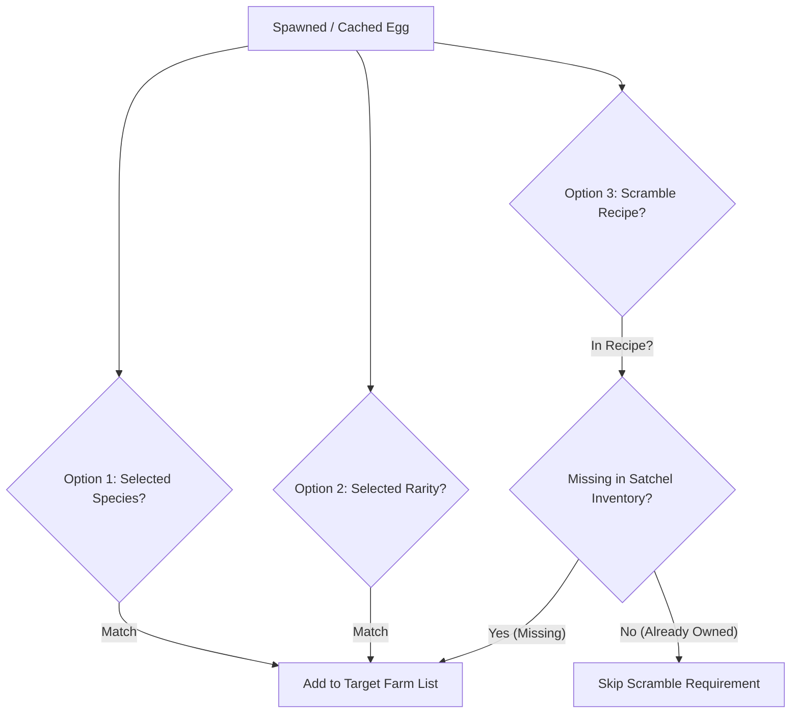

# Current Logic & System Architecture Summary
**Target Codebase:** [`farmer/EggGoToUI_v9_9.lua`](./EggGoToUI_v9_9.lua)  
**Version:** v9.9 (Production Release)  
**Date:** October 3, 2026

---

## 1. System Overview & Window Geometry
- **Unified Window Dimensions:** Fixed permanently at `380 x 520` pixels across all tabs (**Eggs**, **Pets**, **Scramble**).
- **Navigation Architecture:** Left icon-only sidebar rail (width `46px`) driving a standard `334px` content container (`380 - 46`).
- **Tab Persistence:** All tabs utilize dedicated `ScrollingFrame` elements with `AutomaticCanvasSize = Enum.AutomaticSize.Y` and zero disruptive window resizing on tab transitions.

```
┌────────────────────────────────────────────────────────┐
│ Main Window (380 x 520)                                │
├─────┬──────────────────────────────────────────────────┤
│ S   │ Content Container (334 x 484)                    │
│ I   │ ┌──────────────────────────────────────────────┐ │
│ D   │ │ Tab 1: Eggs & Autonomous Harvester (380x520) │ │
│ E   │ ├──────────────────────────────────────────────┤ │
│ B   │ │ Tab 2: Pets & Fusery Suite (380x520)         │ │
│ A   │ ├──────────────────────────────────────────────┤ │
│ R   │ │ Tab 3: Dr. Scramble Trade-In Suite (380x520) │ │
│(46px│ └──────────────────────────────────────────────┘ │
└─────┴──────────────────────────────────────────────────┘
```

---

## 2. Egg Name Resolution & Species Aliasing Engine
In "Steal an Egg", egg names vary across server recipes, inventory profile records, physical tool names, and world models:
1. **Dynamic Model Scraping (`loadEggSpeciesFromGame`)**:
   - Dynamically inspects `ReplicatedStorage.Assets.Models.Eggs` for live game species models and populates canonical display names.
2. **String Normalization (`normalizeEggSpecies`)**:
   - Strips mutation prefixes: `Rainbow`, `Golden`, `Gold`, `Silver`, `Shiny`.
   - Strips bracket tags (`[...]`) and redundant trailing `"Egg"` / `"egg"`.
   - Strips all whitespace and punctuation for strict token comparison.
3. **Bidirectional Species Aliasing (`X.EGG_SPECIES_ALIASES` & `matchEggSpecies`)**:
   - Maps internal game category tokens to user-facing names bidirectionally:
     - `Galaxy Gecko` $\longleftrightarrow$ `Cosmic Gecko`
     - `Cyclops Gorilla` $\longleftrightarrow$ `Cosmic Gorilla`
     - `Cave Dragon` $\longleftrightarrow$ `Cosmic Dragon`
     - `Dream Axolotl` $\longleftrightarrow$ `Axolotl`
     - `Holy Peacock` $\longleftrightarrow$ `Peacock`
     - `Warden` $\longleftrightarrow$ `King Snake`
     - `Sacred Moth` $\longleftrightarrow$ `Moth`
     - `Winged Lamb` $\longleftrightarrow$ `Lamb`
     - `King Kong` $\longleftrightarrow$ `Gorilla King`
   - Guarantees that server recipe requirements (e.g. `Galaxy Gecko`, `Cave Dragon`) instantly recognize satchel inventory eggs (`Cosmic Gecko Egg`, `Cosmic Dragon Egg`) and map world spawns.

---

## 3. AutoFarm 3-Option Independent Filter Architecture
Target selection in the automated harvester operates under a 3-way `OR` criteria architecture:



1. **Option 1: Explicit Species Dropdown**:
   - Matches any species checked in the multi-select farm dropdown (or `"All"`).
2. **Option 2: Rarity Filter**:
   - Matches any egg whose rarity matches enabled rarity toggles (`Divine`, `Eternal`, `Secret`, `Mythic`, `Legendary`, `Rare`, `Uncommon`, `Common`).
3. **Option 3: Dr. Scramble Recipe Requirements**:
   - Evaluates active slots in `scrambleRequirements`.
   - **Crucial Inventory Gate:** Scramble requirements are **strictly added to the target farm list only if currently missing from the player's satchel inventory**.
4. **Independent Match Isolation**:
   - An egg is farmed if it satisfies **any** enabled option.
   - Owned inventory checks are strictly confined to the Scramble requirement branch. Players can freely farm desired high-rarity eggs or specific chosen species without being blocked by items already held in storage.
5. **Priority Order**:
   $$\text{Divine (Tier 1)} \longrightarrow \text{Eternal (Tier 2)} \longrightarrow \text{Secret (Tier 3)} \longrightarrow \mathbf{\text{Scramble Missing Requirements (Tier 4)}} \longrightarrow \text{Farther Eggs (Tier 5+)}$$

---

## 4. Egg Detection & Defensive Resilience
- **Multi-Container Detection**:
  - Scans `Workspace.Eggs`, `Workspace.WorldEggs`, `Workspace.Debris`, `LocalPlayer.Character`, and `ClientRenderedAssets` (CRA).
- **Multi-Bump & Temporary Carry Defense**:
  - When an egg is bumped by physics or briefly picked up by another player, it is marked as temporarily held. The scanner does not discard the egg from the cache; once dropped or respawned, tracking resumes immediately.
- **Nil-Safety Defense (`attempt to index nil by Uid`)**:
  - All access to egg metadata enforces defensive nil checks (`egg and (egg.uid or egg.Uid)`), preventing crashes caused by uninitialized network records or transient despawns.

---

## 5. Tab 2: Pets & Fusery Suite (Performance Optimized)
1. **Manual Candidate Loading (`manualRefreshFuseCandidates`)**:
   - Fuse candidate pet lists are **no longer scanned continuously or per frame**.
   - Candidates are loaded on-demand via the manual **Refresh** button or upon explicit pet inventory state changes, eliminating client CPU overhead and preventing server rate-limiting on profile fetch remotes.
2. **Auto-Fuse Execution Cadence**:
   - Auto-fuse execution evaluates recipes on a throttled **10-second fixed cadence**.
3. **Fuse Optimization Pipeline**:
   - `findBestFuseRecipe` identifies combinations yielding highest fusion power and rarity advancement, sorting candidates lightest to heaviest to protect high-tier pets.
   - Executes via server remote `RF/PetFusery/FusePets`.

---

## 6. Tab 3: Dr. Scramble Trade-In Suite (Streamlined & Compact)
1. **10-Second Event-Driven Execution Loop**:
   - Initial state is queried once on tab open or via manual `🔄` refresh.
   - Periodic checks evaluate on a throttled **10-second interval** or respond directly to server event signals:
     - `RE/ScrambleTradeIn/BannerRotated`
     - Successful reward claim from `RF/ScrambleTradeIn/AskFinishReveal`
2. **Compact Controls Bar (2-Row Layout, Height: 56px)**:
   - **Row 1:** Live rotation timer countdown (`timerBadge`, width `1, -34`) + Manual Refresh (`refreshBtn`, 28x26).
   - **Row 2:** Priority Toggle (`priorityToggleBtn`, 32%), Auto-Trade Toggle (`autoTradeToggleBtn`, 34%), Trade Action Button (`manualTradeBtn`, 34%).
3. **Streamlined 2-Card UI Architecture**:
   - **Card 1: Recipe Requirements (Auto-Height)**:
     - Shows each recipe slot with status badge (`[✓ OWNED]` / `[⚠️ MISSING]`).
     - Displays canonical display name, required count, and clean inventory copy count (`Inventory: %d copy/copies`).
     - **Removed Clutter:** Internal category labels (`Internal: ...`) and the redundant unplaced matching eggs scrolling card have been completely removed.
   - **Card 2: Live Telemetry & Log (Height: 200px)**:
     - High-performance monospaced log terminal tracking remote requests, snapshot status, rotations, and trade returns.
     - Includes one-click `Copy` (system clipboard) and `Clear` buttons.
4. **Authoritative 3-Step Trade Cycle**:
   1. `RF/ScrambleTradeIn/AskState`: Retrieves active recipe and automatically claims any pending rewards.
   2. `RF/ScrambleTradeIn/AskTradeIn`: Submits ordered distinct 32-hex UIDs `finalUids` (`[1]=uid1, [2]=uid2, [3]=uid3`).
   3. `RF/ScrambleTradeIn/AskFinishReveal`: **Crucial claim step** that unlocks the next recipe and deposits pet rewards into the player's satchel.
5. **Strict Safety Gates**:
   - **Strict Egg Filter:** Verifies `Placement == nil` and validates item category to ensure pets are never sacrificed.
   - **Carrying State Protection:** Auto-trade executions are strictly deferred while `weAreCarrying == true` until the carried egg is safely delivered to home base.

---

## 7. Physics, Navigation & Anti-Rubberband Protection
1. **Dual-Velocity State Machine**:
   - **Travel Speed (`baseVelocity = 300`)**: Active during target navigation, scouting, and retargeting.
   - **Carry Speed (`baseCarryVelocity = 250`)**: Clamped automatically on `weAreCarrying` or confirmed pickup to prevent fling physics and server rubberband triggers.
2. **Frictionless Normalization**:
   - Local character parts set to custom physical properties: `PhysicalProperties.new(0.7, 0, 0, 100, 100)`.
   - Carried egg models set to `Massless = true` and `CanCollide = false`.
3. **Anti-Rubberband Step-Down (`detectRubberband`)**:
   - Samples character displacement over `0.6s`. If pulled backward $\ge 6$ studs in a frame or $\ge 12$ studs over the window, speed drops by `10 studs/s` down to `100 studs/s` minimum until smooth movement resumes.
4. **Micro-Snap Distance Gating**:
   - Approach walks (`walkTo`) engage a 50-stud proximity snap (`SNAP_RADIUS = 50`) aligned beside the target at ground level (`targetY`).
   - Hard micro-snaps are clamped to $\le 75$ studs (`SAFE_SNAP_RADIUS = 75`) to avoid anti-cheat kicks or ragdoll loops.
